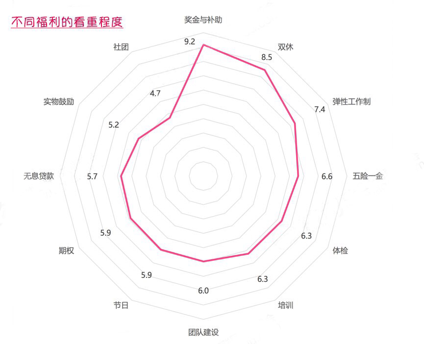
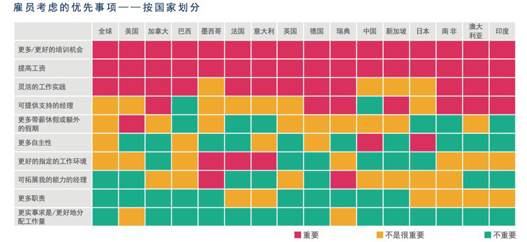
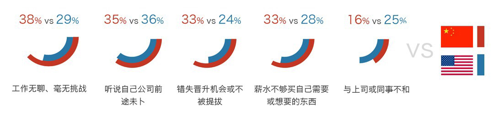
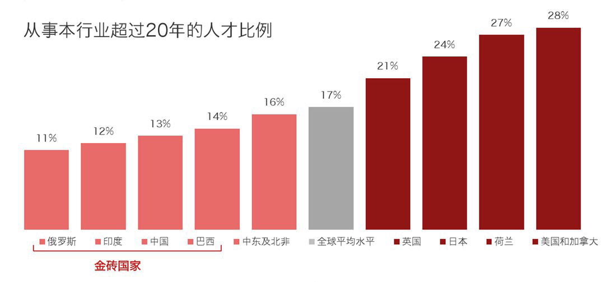

#11-1 2017年趋势一：3个职业发展关键词 

今天是2017年的第一周，这一周我们出一个新年特别版，谈谈2017年可能会出现的新趋势。我们会分3个方面来谈——职业的新趋势、管理和组织的新趋势、人工智能对职业的影响。

今天是第一篇——职业的新趋势。

##3个职场变化趋势

谈到“工作”，字典常常给“职业”下面2种定义：
>- 一个稳定的带薪岗位。
>- 一项任务或者某种工作的一部分，尤指带薪的那种。

前者强调是岗位，后者倾向于任务。未来对工作的定义，会越来越倾向于后面这种：

**工作是一件事，不是一个组织或者一个岗位。**

下面有3个趋势来支持这个变化：

**1.工作内容的不确定**

未来一年中，因为职业的变化、企业的转型，组织的工作内容越来越不确定，每个人都需要针对一个任务重新学习、适应和升级，而不是一个岗位的固定技能。 **而你做得好不好，是以最后的结果来判定。**

**2.零工经济抬头**

企业越来越倾向于**为一个项目聘用相关技能的人才 **，而不是提供全职岗位。

根据德勤年度报告来看，83%以上的高管反映：今后几年计划增加临时的兼职人员、工作时间灵活的员工，71%的高管和人力资源负责人认为零工经济重要或非常重要。

所以未来几年， 非全职员工、不坐班的员工、弹性上班的员工会越来越多。

**3.分布式办公**

工作时间和个人时间互相交织，工作场所移动化，工作和私人界限日益模糊，工作也不再意味着某个场所。

从格子间到联合办公空间，再到任何一个有网络的地方，咖啡厅、家里、酒店、80公里以外的地方，甚至不同的国度，都有可能成为新的办公空间。

前段时间，一个著名的会计师事务所合伙人跟我说，现在他们公司已经取消了合伙人的独立房间，把他们赶到了一个更开放的空间来。同时，公司还期待大家多往客户那边跑，尽量不要在公司呆着。

不管你是管理者，还是员工，你都要逐渐适应或者有机会尝试这种移动分布式办公的方法。

现在，我们再来看“工作”的第一种定义——一个稳定的带薪岗位，就会发现不太适合了。在今天—— 

工作不再指代某个岗位、某个场所，而是指能不能在有限的时间内高质量地完成某一件事。

##3个职场关注重点

在这样的职场环境中，新一代职场人关注点也会有所改变。

**1.个人时间**

根据拉勾2016年的报告来看，这群互联网从业者，对于 “**双休**” 与 “**弹性工作制**” 的看重程度超过了“五险一金”，分别排在了第二、第三名。

“奖金与补助”毫无疑问成为从业者们最看重的福利，但对“双休”和“弹性工作制”重视程度的上升，说明——

这一代职业人士会更加理性地看待自己的身体，他们并不像以前一样，拼命地挣钱，老的时候再用医保把自己治回来，而是在年轻时，就懂得保护自己的身体和状态。

**2.看重自我发展**

这群人除了看重“个人时间”外，还非常看重“自我发展”。

在美世全球人才趋势报告中，可以看到“更多的培训机会”和“提高工资”是各个国家人才都看重的2个因素，而在第三看重的因素上，则会有很大不同。（如下表）

中国的职场人，最看重三个因素：更多培训机会、提高工资、更多自主性。

最不重视的是：更多职责，公平分配工作量、可提供支持的经理。

而与中国相反的是新加坡和瑞典，他们最看重的是可提供支持的经理，最不看重自主性。

这种差异，是因为中国正处于个体崛起的时代，人们觉得自己不那么需要组织—— **在职业中给他们提供自主空间，比提供支持更加重要。** 

现在，中国正处于一种年轻人嗖嗖顶上，疯狂学习，并觉得自己无所不能的时代，当然有一部分是幻觉。

同时，领英的报告也指出，职场人找新机会的理由主要是： **“工作无聊无挑战” 、 “公司前途未卜” 、 “没有晋升机会” **、“薪水不够”等。前三个都是自我发展受限导致的离职。

**3.开放跨界**

领英《2016中国人才趋势报告》数据显示，高达 95% 的中国职场人士会对新的工作机会感兴趣，这一比例明显高于世界平均水平（90%）。

更有趣的数据是——在这95%的人里，只有22%的人在主动找工作，也就是说有73%、近四分之三的人在观望，他们在寻找可能性。

中国人的行业稳定性也相对较低——只有 13% 的职场人士从事本行业超过 20 年，而全球平均水平是17%，北美地区则高达28%。

这种高流动性，一方面可以解释为：** 开放性、积极、跨界 **，另一方面也可以说是**浮动、躁动** 。

这些变化的原因，一方面是因为中国经济快速发展，企业转型、机会变多；另一方面也是因为新一代职场人经济压力不大，更多**依靠自我感受、兴趣特长，或者趋势机会来选择就业方向。**

这些因素造就了这一代前所未有地来关注自我空间，关注自我发展，他们是对于新机会时刻在准备着的职场新一代。

##3个关键词

要过好2017年的职场，我有下面三个关键词：

**1.自由职业态与结果思维**

这个，我在栏目文章中多次提到：

**自由职业态是一种身法** ——完全把自己当成一家外包的企业来经营和思考。（见文章2-1）

**“结果思维”是一种心法** ——怀着“终极结果”的心态来做事情。（见文章9-2、9-3）

**职场人只有这样的身态和心态，才能逐渐适应企业多变的任务化、零工化和分布式办公的趋势。**

**2.投资自己，联盟组织**

在个人时间，要积极寻求优质的成长资源，比如说订“得到”专栏；在组织内也要积极寻找和要求学习机会。

我看了大量的关于自由职业者和兼职的报告发现，其实到今天，兼职和自由职业者大多在24岁以下，平均收入3000块钱左右，简单来说，就是并没有形成高级的自由职业者和兼职的大市场。

在很长时间，希望从事自由职业的人，可能还是需要和组织密切合作。

所以我认为——在所有人都希望脱离组织做超级IP的时代，  真正的超级个体，能和组织、平台合作，能与管理者密切协同、战略联盟，这样反而成长会更快。

同时，能够提供优质的学习资源、弹性办公方式的组织也会变得越来越有吸引力。

**3.积极探索，小心移动**

在人才流动速度越来越快的时代，职场人越要冷静。要避免做无意义的蠢动，或者随大流的躁动。可以**加大探索力度，看好才动 **。

当你做好这三件事——有自由职业态和结果思维、投资自己联盟组织、积极探索小心移动，这个变化和不确定的时代就是你的朋友。

参考文献：（本周没有工具卡）
- 《德勤：2016全球人力资本趋势》
- 《拉勾：2016互联网职场生态白皮书》
- 《美世：2016全球人才趋势研究报告》
- 《领英：2016中国人才趋势报告》

##“双面神”游戏

昨天提到罗马神话里的“双面神”——这个神有两张脸，一面看向过去，一面看向未来。新年第一周，我们玩个“双面神”游戏吧！用一个关键词回顾2016，再用一个关键词展望2017。

下边是具体玩法：

1.	每个人要写的内容包括：回顾—期待—支持。
具体格式如下——
- 2016年我的关键词是……，因为…… 
- 我期待2017年的关键词是……
- 我希望获得的支持是……
- 我能提供给大家的支持是……
比如，
- 我2016年的关键词是“突破”，因为今年我在工作方面有一个重大突破，全年销售目标完成200%。
- 我对2017年的期待是“平衡”，希望在今年有1次带父母旅游的机会；同时在工作不停滞的前提下，准备要宝宝。
- 我希望获得的支持是，适合老人出行的旅游目的地推荐。
- 我能提供给大家的支持是，自我管理、提高效率的方法。

2.全文不超过240字，这样方便阅读。

3.符合规则的，我会尽量每个都精选，但是留言区一共只可以精选200席，所以先到先得。

4.请认真写，走心的内容会给你自己和更多人带来帮助。

5．已经在“超级共同体”学习小组中建好了同样题目的帖子，大家在下面留言后，可以直接粘贴到帖子中去。在那里，你对谁的“回顾”、“期待”、“支持”感兴趣，可以互相勾搭