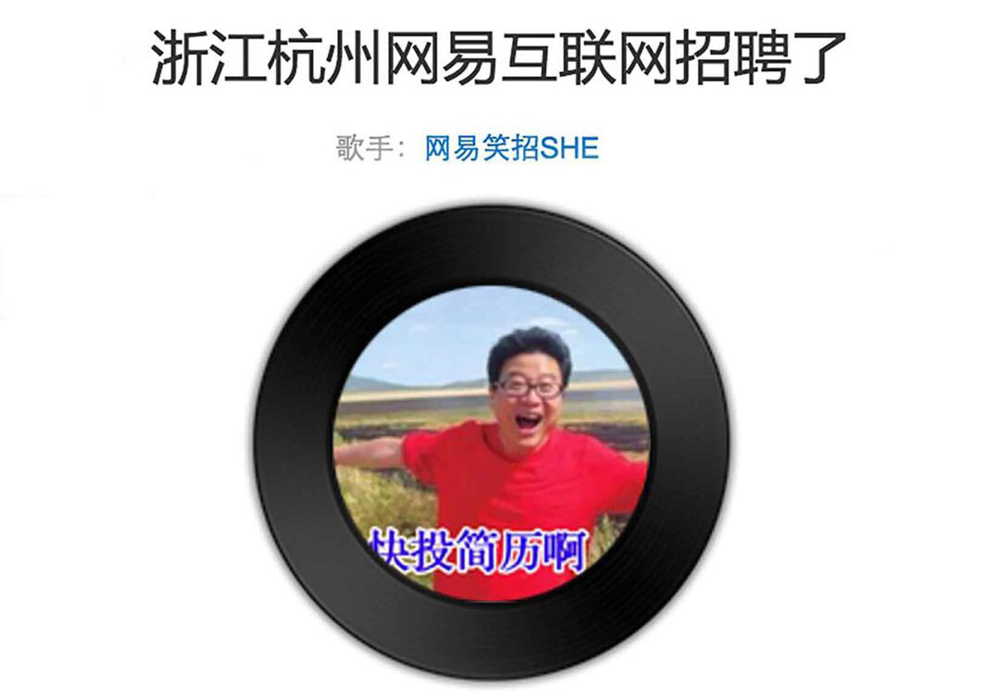
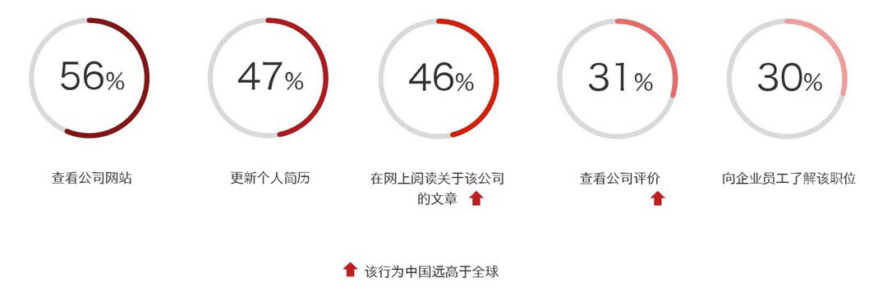
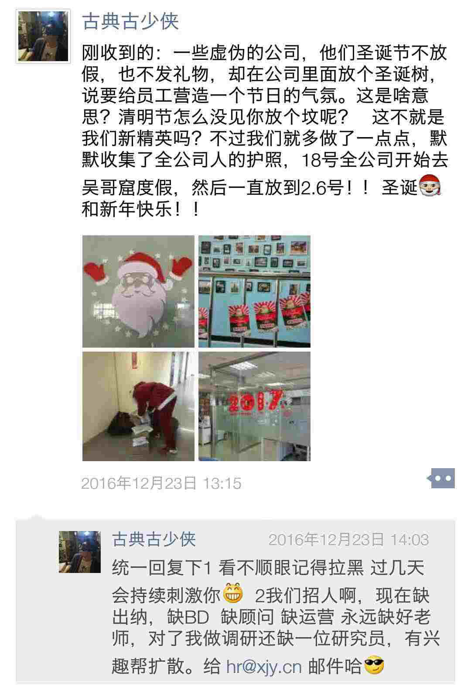
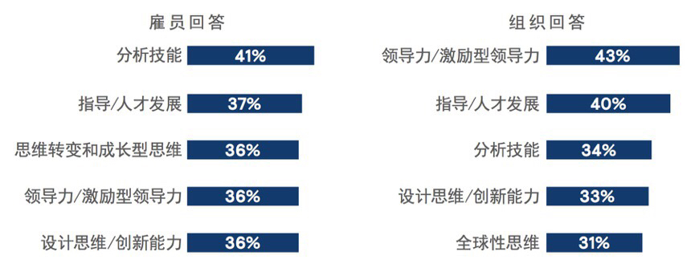

#11-2 2017年趋势二：管理者的3个改变 

在2016年的校招活动中，网易推出了一首刷爆朋友圈的神曲——《浙江杭州网易互联网招聘了》。
歌曲以一身红火狂奔在大草原上的丁磊为封面照片，搭配“快投简历啊”的蓝色大字；浓浓的“江南皮革厂大甩卖”风招聘文案，配以鬼畜的洗脑旋律——我们先一起来感受一下这首充满着江南皮革厂大甩卖风格洗脑神曲。

一首歌，让网易自黑的清奇画风呼之欲出。歌曲上线1天，网易就收到了近4000份技术类简历。短短10天，网易校招团队收到的简历数量已达到了2015年的2倍，营销效果显著。
**1.像营销一样去招聘**
领英《2016年中国人才趋势报告》显示：72%求职者在申请职位之前，就已经对雇主品牌有印象了。求职者在得知职位信息后不会立刻申请，而是更趋向于去检索、阅读与该公司有关的文章或评价。一般他们会这么做：

在做完这些调查后，他们才会决定要不要给雇主公司投简历。也就是说—— **在你面试求职者之前，你早就被别人在网上面试过了。**
不知道你看出来没有，如果把岗位当作“产品”，通过社交媒体招聘，这越来越像一场雇主和雇员之间的**双向营销** ——雇主打造自己的品牌，吸引潜在员工；而员工看到职位信息以后，除了调查雇主，也会回去根据要求精心地“打扮”一番，然后才开始面试。
21世纪，最稀缺的是人才。未来一年里，企业的人才竞争会在三个层面打响：
**（1）	空军：通过社交媒体招聘**
公司要充分利用各种社交媒体的新渠道、新玩法，展示公司的文化、价值观和招聘职位，以确保自身的信息，在海量的数据中脱颖而出，使应聘者在申请职位之前能发现公司和职位。
网易的神曲传递给大家的就是一种自黑的公司文化，让人觉得没有距离感。
圣诞节，我在朋友圈发了条微信，收到很多条评论和点赞。还有不少人问“公司还招人吗”，我顺手发了个招聘需求，现在招到了一位助理和一位运营人员。

**（2）	陆军：通过朋友圈地推**
我在职业价值体系（见文章1-1）中提到过，个人价值体系—— 圈子X能力X个性的坐标系日益成熟。
每一位员工——尤其是优秀的员工都是一个小小的人才路由器 。企业可以通过鼓励“内推”（内部推荐人才），让每个员工尤其是优秀员工，在朋友圈推广和推荐人才。这往往是非常高效的招聘方式。
**（3）	情报部门：利用大数据来选用育留**
在未来5年，运用大数据来分析、预测员工与职位的匹配度依然是个热门话题，企业选用育留都需要考虑大数据。
《圣经》有一句话—— **凡走过的，必有痕迹**。 两千年前的话，在今天这个信息时代变得越来越真实。
今天很多招聘人员拿到一个应聘者的QQ邮箱后，会仔细看这个人的QQ空间，看他自己的个人公众号和微博，从中更加深刻地了解自己的应聘者，同样在做这些工作的也有应聘者。
董明珠在股东会上发飙的视频会在一小时内传遍网络。孔子时代的“慎独”在今天，也许有了更加深刻而实用的意义。
**2.像教练一样去管理**
哪些技能在未来12个月内需求最大？
在领英的2016年《人才发展趋势报告》中，有两种技能同时在雇员和组织需求中进入前五，你猜是什么能力？—— **激励型领导力和员工辅导 。**

2017年，是95后“小鲜肉”们进入职场的第一年。当我们还在讨论“90后管理”的时候，95后小怪兽们又杀到了。到2020年，80、90后会占到一半的职位。
这些新的员工有更强的互联网能力、更多的创意和更新的知识结构，同时，这群经济压力不大的独生子女也有相对缺乏成就动机、情绪和自我管理以及组织协作的能力的一面。
从调查结果来看，他们自己居然也非常清晰这一点——他们期待组织提供给自己员工辅导，个性化的激励，以及推动自己思维转变。
所以，未来管理者很重要的一种能力，就是为每一个个体量身定制不同的方案来激励他们——提供个性化的学习方法和方案，倾听和回应他们的需求。
消费升级强调的情怀、温度、创意是管理不出来的——在情绪积极快乐的前提下才会涌现。
过去那种按照一个工资梯度、一个玩法就能激励所有人的时代，正在慢慢远去。未来的管理者需要成为一个能识人、能驱动人的优秀教练。
**3.像设计师一样设计办公空间**
不仅仅是心理状态，需要改变的还有物理空间，越来越多企业像设计师一样，提供有趣便利的上班环境——提供员工零食、可以升降的电脑台、顶级的咖啡、弹性的上班时间、带妈妈育婴室的房间…………
甚至我自己的团队，我经常希望他们自己去找好玩的地方工作，不要来公司待呆着——员工只有真的得放松和开心了，他们的创意才会源源不绝。
总之，作为现代管理者， **make things happen 比make things 更加重要。** 
想象一下2017年即将出现的这些新型管理者：
**他们像营销高手一样招人，像顶级教练一样辅导和激发员工，又像设计师一样创造一个灵活有趣的办公空间。**
你说，他们是一群是什么样的人？他可以像所有人，但是永远不再像你印象中的那个“领导大人”啦。
##“拉仇恨”
今天想请你聊聊你们公司：
- ①这家公司做过哪些事，让你至今念念不忘？
- ②公司里有什么值得秀晒炫或细小却贴心的福利？
- ③让你欣赏的管理者都有哪些特质，他们厉害在什么地方？
总之，请尽情“拉仇恨”，让我们看看“别人家的公司”都长什么样。欢迎留言。