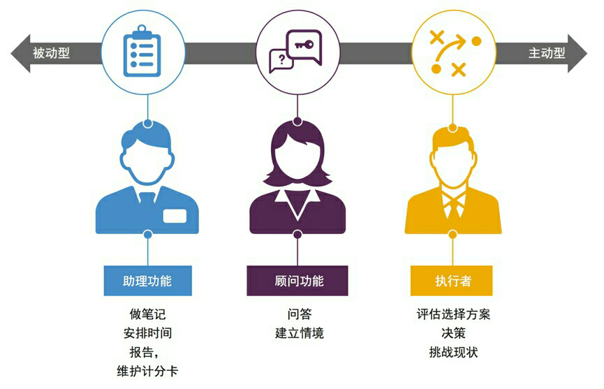

#11-3 2017年趋势三：进入AI职场时代的最好机会 

当我们回顾2016的时候，谷歌AlphaGo战胜韩国棋手李世石，是一个绕不过去的大事件。

谷歌的野心并不止步于做一个战胜人类的棋类程序。他们宣布，这套人工智能一旦成熟，将用于灾害预测、医疗健康和机器人等更广阔而复杂的领域。

艺术往往是现实的预测，2016年年底的神剧《西部世界》也讲述了一个人工智能倒戈人类的故事……这部豆瓣打分到了9.0的神剧，讲的就是机器人重新获得意识的故事——我就不剧透了。

人工智能进入职场的结果是** 《终结者》** ，还是陪伴帮助人类的 **“大白”** ？ 

**来临速度比你想得快**

不管这个变化的结果是什么，它的速度都超过你的想象。

**人工智能** ，简称AI，通过模拟人类的思维、意识和行为来完成复杂的工作。它的年龄并不长。

1956年，以麦卡赛、明斯基、罗切斯特和申农等为首的年轻科学家聚在一起，共同研究和探讨用机器模拟智能的一系列有关问题，并首次提出了“人工智能”这一术语，它标志着“人工智能”这门新兴学科的正式诞生。

到去年，这个技术才60岁。但就在去年的世界经济论坛报告里，人工智能被预测为第四次工业革命的核心技术代表，将在今后五年里，改变商业模式和劳动力市场。

人工智能和大数据资源将会像水和电一样，由专门公司提供给全社会所有人使用——全社会产业都会经历： **现有产业+机器智能=新产业的大变革** 。

领英发布的《2016全球人力资本报告》中指出：到2020年，全球将会有700万个工作岗位消失， **包括一些基础白领和蓝领技工**等；另一方面， **计算机、数学、建筑**等领域能够创造200万个新的工作机会，因此这中间将会产生500万个工作缺口。我们目前视为核心的技能，有超过1/3到2020年都将改变。

到2025年，科技变革达到新的**临界点** （也就是奇点）。
- 2021年，首款机械药剂师将在美国登场；
- 2025年，30%的公司审计工作将由人工智能完成；
- 2026年，无人驾驶汽车将占美国汽车保有量的10%。

看到这，很多人会说，2020年还早呢，而且，我怎么不觉得这个变化呢？

之所以没有感觉到变化，也许是因为莲塘效应——你看夏天有莲叶的池子，假设每天以一倍的数量铺开，第一天有1/32占据湖面，第二天1/16，这样一直到第五天1/2时，你都不觉得莲叶多，一直到第六天一开，所有湖面都是莲叶。

这就是**莲塘效应** ——变化在细微的时候，你总觉得很小，其实是巨大的。

现在距离2020年还有3年——3年正好是从初学一门技能到精通并且在业内有竞争力的时间。如果现在能够学习一门人工智能时代的的技能，进入合适的领域，是一个打开全新职业时代的机会。

**什么职业会受威胁？**

距离2020还有3年，什么样的职业会受到威胁？
1.**蓝领 **——重复的、标准化程度高的机械性劳动。

比如大部分装订装配工作、搬运都已经变成机器劳动。

2.**初级白领** ——规则性、协作关系简单、维度少的智力活动

比如银行柜台、高速公路收费站、出纳等。

简单来说——规则性强、协作能力低、节点少的职位会被淘汰。被淘汰并不意味着消失，但是意味着这个领域的投入产出比会极低。

那么——什么职位会越来越重要？ 

- 高端技术人才：大数据、人工智能、程序编写者、生物科技等
- 复杂模式判断者：需要强大的思维逻辑和模糊情景判断能力（政治家、企业管理者、投资人等）
- 创意工作者：为追求趣味，发掘人类爱好而创作（艺术家、音乐家、导演、作家、演员）
- 人际服务者：通过深度的人与人互动的服务来工作（高端服务业、高端手工业、厨师、心理咨询师等）

**什么行业会有新机会？**

各个行业中与人工智能、大数据等搭接的领域会有新机会。

王健林曾经提出过一个观点， **未来中国最大的机会在服务业——不是传统服务业，而是现代服务业。**

他认为第一个是娱乐业，在中国经济 7% 的增长速度下，娱乐业的增长连续六年超过40%，未来有很大的空间。

第二是体育产业，现在中国只有两三百亿美元，距离美国还有几十倍的增长空间。中国人都在追求健康长寿，体育产业有很大空间。体育营销、体育传媒、体育竞赛等专业缺乏人才。

第三是旅游行业，尤其是线上线下结合的旅游行业。

这三个行业也是典型的人际交往多、需要创意、复杂的行业。

**职场人该如何面对？**

对于**职业新人**来说：

- 除了培养专业能力外，注意培养自己这些能力：创造力、社交能力、分析、思考和判断能力、审美能力、当然还有学习能力。尤其是创造力和社交能力，这两项是人工智能无法拥有的。
- 持续地尝试最新的科技和技术，多关注一些大数据、人工智能的入门书籍。
- 留意自己行业内与人工智能、大数据接口的职位和公司，保持对这件事的观察和好奇。
对于**中高层管理者**来说，他们也面临下面这些转型：

1.视智能机器为同事。

根据埃森哲的研究，未来几年，机器人可能会成为你团队中的一员。他至少是下面3个角色中的一个或者多个，他可能会做你的助理、顾问，甚至执行者，要懂得用好这些人。

2.专注于判断性工作

未来，人工智能能承担越来越多的常规性工作，甚至辅助人们的决策，但它无法开展 “判断性工作”。

**“判断性工作”是指——在无法获得充分或可靠信息时，如何运用人类自身经验和专业知识来作出关键的决策。**

3.专注业务——将行政工作交给人工智能

今天的管理者花很多时间在协调和管控上，而这部分工作未来很大部分会被人工智能接管。

诸如时间安排、资源分配、报告等， **未来的管理者应该是业务专家** ——如设计机构艺术总监、医院外科主任医师、科研项目负责人或是管理咨询项目经理等。有专业技能的管理者，会更加受欢迎。

4.像设计师和教练一样工作

管理者的创造力固然重要，但激发他人创造力，并且整合的能力更重要。

讲了这么多，来做个总结——其实你**不妨把人工智能时代想象成一个初入职场的理工天才** ，比如《生活大爆炸》里的谢尔顿——他体力比你好，效率比你高，记忆力很好，而且知识更新还比你快——但是社交能力很糟糕、对于复杂和不确定的事情一筹莫展——你和他PK是无意义的，要学会与他快乐地玩耍。

遵循原则——** 做机器不能做的事，同时要学会与机器合作**。

回到开篇的提问：未来的职场到底是“终结者”还是“大白”？——估计都不是，人机高度合作的 **《星际迷航》** 可能才是最后结局——人类通过与机器合作，成为更强大的物种，可以去到以前无法触及的地方。

如果你也这么想——2017年正好是进入这些领域，提升这些技能的一个重要时机。

##一起来做分析师

今天，我邀请大家一起来做行业分析师，聊聊你所在行业的发展状况。我会挑选最有启发的20条留言，给这些小伙伴寄一份由新精英出品的“18个行业的分析报告”。

作为“行业分析师”，你可以在留言中聊聊这些话题——

①	你在什么行业，从事什么工作？

②	去年这个行业的整体态势是上行、持平还是下行？

③	你所在行业内领先的机构或组织是哪三家？

④	这个行业现在的热点是什么？

【你可以参考思考模型，从PEST四个方面其中一个来讲：

Political（政治），如一带一路；

Economic（经济），如经济下行；

Social（社会），如全民娱乐； 

Technological（科技），如VR、大数据招聘。】

⑤	未来一段时间，你看到这个行业里有哪些机会？